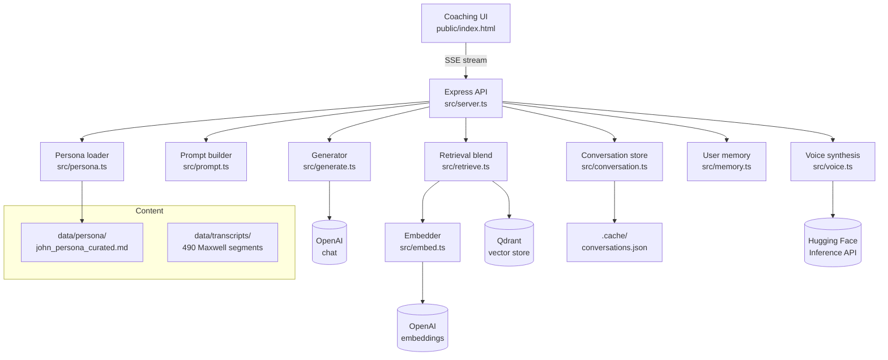
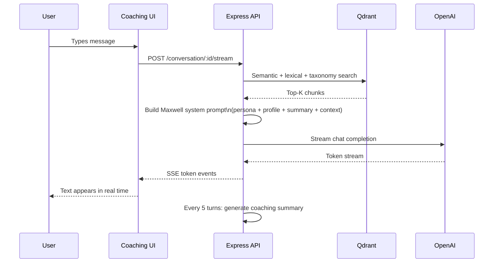

# John Maxwell AI Coaching Brain

A production-ready Node.js + TypeScript RAG (Retrieval-Augmented Generation) backend that delivers a personalized coaching experience in the voice of John C. Maxwell. The system ingests Maxwell's transcripts, retrieves the most relevant teachings for each question, and generates warm, practical, first-person coaching responses — just as Maxwell himself would speak.

---

## Features

- **Maxwell's voice** — Rich system prompt encoding Maxwell's 5 Levels of Leadership, 21 Laws, storytelling cadence, emotional warmth, and first-name coaching style
- **490 real transcript segments** — All ingested into Qdrant vector store; auto-reingested on server start
- **Curated persona** — 8 real Maxwell stories (father's Depression-era work ethic, "growth is happiness" mentor, "do it now" exercise, Robert Schubert failure pivot, Andrea Jung "give 60/take 40", and more)
- **Dynamic personalized opening** — Three greeting variants based on whether the user has provided their name, challenge, or nothing
- **Coaching session memory** — Auto-generates a 2–3 sentence summary every 5 turns and injects it into the system prompt for continuity
- **Immersive coaching UI** — Forest-green/gold aesthetic, SSE real-time streaming, Maxwell avatar, 3-step onboarding wizard, mobile-first
- **Blended retrieval** — Semantic (vector) + lexical overlap + 11-category Maxwell taxonomy weighting
- **True SSE streaming** — Tokens stream directly from OpenAI with no buffering
- **No citation leak** — `[#N]` markers are always stripped from the spoken answer
- **Emotional awareness** — Detects distress signals and adjusts Maxwell's opening acknowledgment
- **TTS-ready** — Voice pipeline wired for Hugging Face Inference API (parler-tts recommended)
- **Persistent conversations** — Threads stored to `.cache/conversations.json`, survive server restarts

---

## Quick start

### 1. Install and configure

```sh
cp .env.example .env
# Edit .env — at minimum set OPENAI_API_KEY
npm install
```

### 2. Start Qdrant (vector database)

```sh
docker run -d --name maxwell-qdrant -p 6333:6333 \
  -v maxwell-qdrant-data:/qdrant/storage qdrant/qdrant
```

### 3. Start the server

```sh
npm start          # production (uses dist/)
# or
npm run dev        # development (ts-node, hot reload)
```

The server auto-ingests transcripts from `data/transcripts/` on startup.

### 4. Open the coaching UI

Navigate to `http://localhost:3000` in your browser. You'll be walked through a 3-step onboarding and then into a live coaching session.

> **Without `OPENAI_API_KEY`:** The server runs in stub mode with a local hash embedder. Structural features work but answer quality is placeholder text. Set the key for real Maxwell-voiced responses.

### Container quick start

The repository includes a multi-stage Dockerfile and a Compose stack for local development. The default app and test services both use the Dockerfile `dev` stage, run Node inside containers, keep `node_modules` inside the shared image, and use Qdrant as a supporting service.

```sh
docker compose up --build
```

Podman users can run the same stack with:

```sh
podman compose up --build
```

Run build and tests inside the Node container:

```sh
docker compose --profile tools run --rm test
```

Podman:

```sh
podman compose --profile tools run --rm test
```

Build and run the production image with:

```sh
docker compose --profile prod up --build app-prod
```

On macOS with Podman `5.8.2` and the `applehv` machine provider, `podman machine start` can report success while the next Podman command cannot connect. If that happens, run the start and compose command together:

```sh
podman machine start podman-machine-default && podman compose up --build
```

The Compose stack exposes:

- Coaching UI and API: `http://localhost:3000`
- Qdrant: `http://localhost:6333`

By default, Compose uses `EMBEDDING_PROVIDER=local` so the app can boot without API keys. To use real OpenAI embeddings and generation, copy `.env.example` to `.env`, set `OPENAI_API_KEY`, and set `EMBEDDING_PROVIDER=openai`.

---

## Environment variables

| Variable | Default | Description |
|---|---|---|
| `OPENAI_API_KEY` | — | **Required for real responses.** Get from platform.openai.com |
| `OPENAI_CHAT_MODEL` | `gpt-4o-mini` | Chat model for generation |
| `EMBEDDING_PROVIDER` | `openai` | `openai` (recommended) or `local` (dev/stub) |
| `EMBEDDING_MODEL` | `text-embedding-3-small` | Embedding model |
| `VECTOR_DB` | `qdrant` | `qdrant`, `pinecone`, or `memory` |
| `QDRANT_URL` | `http://localhost:6333` | Qdrant instance URL |
| `PERSONA_PATH` | `./data/persona/john_persona_curated.md` | Curated persona stories file |
| `RETRIEVE_ALPHA` | `0.6` | Weight for semantic (vector) score |
| `RETRIEVE_BETA` | `0.2` | Weight for lexical overlap score |
| `RETRIEVE_GAMMA` | `0.1` | Weight for taxonomy tag score |
| `ADMIN_API_KEY` | `changeme_admin_key` | Admin endpoint key |
| `API_KEYS` | `changeme_client_key_a,...` | Comma-separated client keys |
| `CONVERSATION_STORE_PATH` | `.cache/conversations.json` | Thread persistence path |
| `HUGGINGFACE_API_TOKEN` | — | For TTS voice synthesis |
| `HF_TTS_MODEL` | `parler-tts/parler-tts-large-v1` | Recommended TTS model |
| `HF_TTS_PARAMETERS` | *(see .env.example)* | Voice description for parler-tts |

See `.env.example` for the complete list.

---

## API reference

### Conversation (primary interface)

| Method | Path | Description |
|---|---|---|
| `POST` | `/conversation/start` | Start a new session. Body: `{ profile?, userId?, seed? }`. Returns `{ id, openingMessage }` |
| `POST` | `/conversation/:id/send` | Send a message. Body: `{ query, topK?, temperature? }`. Returns `{ answer, citations, model }` |
| `POST` | `/conversation/:id/stream` | Same as send but streams tokens via SSE |
| `GET` | `/conversation` | List all threads |
| `GET` | `/conversation/:id` | Get a thread's messages |

### Profile

| Method | Path | Description |
|---|---|---|
| `GET` | `/profile?userId=` | Get user profile |
| `POST` | `/profile` | Save profile (firstName, role, industry, currentChallenge, goals, …) |

### Ingestion

| Method | Path | Description |
|---|---|---|
| `POST` | `/ingest` | Ingest URL, raw text, or base64 PDF |
| `POST` | `/ingest/transcript` | Ingest a Maxwell transcript segment |
| `GET` | `/corpus/stats` | Check ingestion progress and chunk count |

### Generation (stateless)

| Method | Path | Description |
|---|---|---|
| `POST` | `/generate` | One-shot query + generate (no thread) |
| `POST` | `/generate/stream` | One-shot SSE stream |
| `POST` | `/generate/voice` | Generate answer + synthesize to audio |
| `POST` | `/tts` | Synthesize text to audio |

### Other

| Method | Path | Description |
|---|---|---|
| `GET` | `/health` | Server status, embedding provider, voice config |
| `GET` | `/query` | Raw retrieval without generation |
| `GET` | `/memory` | User memory/preferences |
| `POST` | `/feedback` | Record which chunks were helpful |
| `GET` | `/admin/config` | View runtime config *(admin key required)* |
| `POST` | `/admin/config` | Patch runtime config *(admin key required)* |

---

## Architecture



### Request flow



---

## Transcript ingestion

Transcripts in `data/transcripts/` are auto-ingested on server startup. To manually bulk-ingest against a running server:

```sh
npm run ingest:transcripts -- data/transcripts http://localhost:3000 <api-key>
```

The script is resumable — progress is saved to `.ingest_progress.json`.

---

## Voice (TTS)

Set these in `.env` to enable the 🔊 voice button in the UI:

```sh
HUGGINGFACE_API_TOKEN=hf_...
HF_TTS_MODEL=parler-tts/parler-tts-large-v1
HF_TTS_PARAMETERS={"description":"A warm, deep, authoritative male voice with Southern American accent speaks at a moderate, unhurried pace with confidence and gravitas. No background noise."}
```

Get a free token at [huggingface.co/settings/tokens](https://huggingface.co/settings/tokens). No GPU required — parler-tts runs on HF Inference API.

---

## Evaluation and tuning

```sh
# Baseline retrieval quality (recall, MRR)
npm run eval:retrieval

# Grid search over alpha/beta/gamma weights
npm run eval:tune
# → writes tuning_results.csv; update RETRIEVE_* in .env with best values

# Structural QA — 6 scenarios, 25 checks (runs in stub mode)
npm run qa
```

---

## Project structure

```
src/
  server.ts          Express API, auth, metrics, conversation/profile endpoints
  prompt.ts          Maxwell system prompt, emotional detection, session arc
  generate.ts        OpenAI generation, SSE streaming, citation handling
  persona.ts         Persona file loader, relevance scoring, snippet injection
  conversation.ts    Thread store, coaching summary, persistence
  maxwell_taxonomy.ts  11 Maxwell topic categories for chunk tagging
  embed.ts           Embedder implementations (OpenAI, local fallback)
  retrieve.ts        Blended scoring: semantic + lexical + taxonomy + rerank
  memory.ts          User preference memory and category decay
  voice.ts           Hugging Face TTS synthesis
  config.ts          Runtime config from env
  ingest.ts          Web/text/PDF ingestion
  parse.ts           Cleaning, chunking, tagging
data/
  transcripts/       490 Maxwell transcript segments (John1-000 … John5-059)
  persona/
    john_persona_curated.md   8 real Maxwell stories (source of truth)
    john_persona_drafts.md    Raw extracted fragments (reference only)
public/
  index.html         Immersive coaching UI (onboarding, SSE streaming, avatar)
scripts/
  bulk_ingest_transcripts.ts   Resumable bulk ingestion
  qa_conversation.ts           Structural QA test suite
tests/
  generate.stub.test.ts
  utils.chunkText.test.ts
  taxonomy.tagContent.test.ts
  retrieval.scoring.test.ts
```

---

## Running tests

```sh
npm test
```

All 7 unit tests cover: stub generation, chunking, taxonomy tagging, and retrieval scoring.

---

## Roadmap

- [ ] Add `OPENAI_API_KEY` for real semantic retrieval and Maxwell-voiced responses
- [ ] Multi-session coaching memory (persist across browser sessions)
- [ ] Analytics dashboard (which teachings resonate most)
- [ ] Expand transcript corpus (Maxwell books, podcasts)
- [ ] Feedback loop — users rate responses to improve retrieval weights
- [ ] Audio ingestion pipeline (speech-to-text for new Maxwell content)
