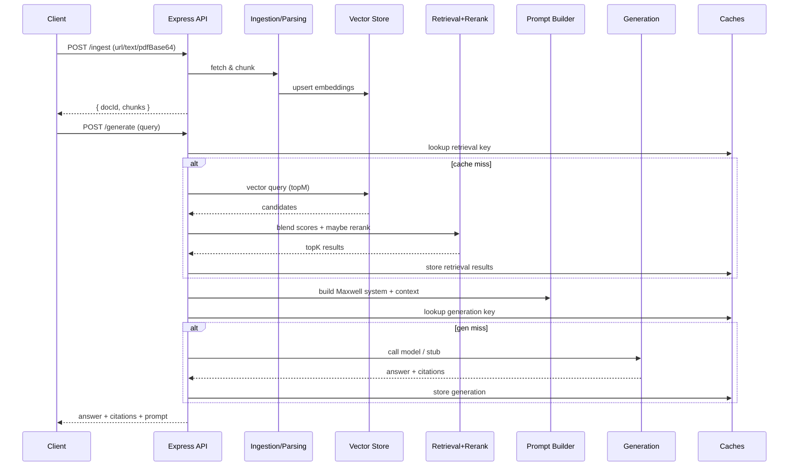
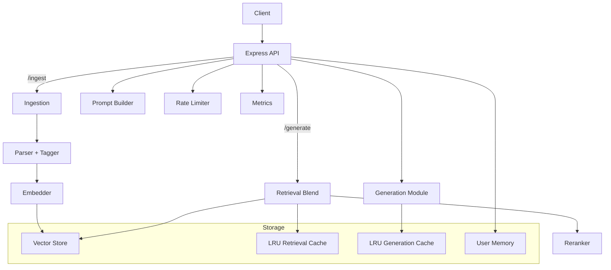

# John Maxwell Voice Coach Brain (Scaffold)

A Node.js + TypeScript foundation for a retrieval-augmented coaching assistant in the style of John Maxwell. This scaffold includes ingestion, parsing, embeddings, vector store, retrieval, prompt construction, generation, and an Express API.

Note: Maxwell-specific advanced logic (streaming generation, richer citations, cross-encoder reranking) are still TODOs; a basic `/generate` endpoint is now implemented with OpenAI Chat (stub fallback if no API key).

## Quick start

1. Copy .env example

```sh
cp .env.example .env
```

2. Install deps and run dev

```sh
npm install
npm run dev
```

3. Try endpoints
	- GET /health
	- POST /ingest { type:"web", source:"https://example.com" } OR { type:"text", source:"Manual", content:"..." }
	- POST /ingest { type:"pdfBase64", source:"Leadership Growth", base64:"<base64>" }
	- POST /query { query: "How to lead?", topK: 5 }
		- POST /generate { query: "How to lead?", topK: 5, temperature: 0.7 }
		- POST /generate/stream { query: "How to lead?" }  (Server-Sent Events)
	- GET /metadata
	- GET /memory/:userId
	- POST /memory { userId: "u1", preferredCategories:["leadership_principles"] }

## Architecture
Core modules:
- `src/ingest.ts` – web/text/PDF ingestion
- `src/parse.ts` – cleaning + chunking + taxonomy tagging
- `src/embed.ts` – embedders and vector stores (memory / Qdrant / Pinecone)
- `src/retrieve.ts` – indexing + blended scoring (vector + lexical + tag) + optional rerank
- `src/rerank.ts` – pseudo cross-encoder reranker
- `src/prompt.ts` – assemble system + context with scores & tags
- `src/generate.ts` – answer generation (OpenAI / stub) + citations + streaming
- `src/memory.ts` – user memory & preferences
- `src/cache.ts` – LRU caches for retrieval & generation
- `src/rate_limit.ts` – token bucket rate limiting
- `src/server.ts` – Express API, auth, metrics
- Support: `src/config.ts`, `src/logger.ts`, `src/errors.ts`, `src/types.ts`, `src/utils.ts`

### Sequence Flow


### Component Diagram


### Data Flow Summary
1. Ingestion: Raw source (web/text/PDF) is normalized, cleaned, chunked with overlap, taxonomy-tagged.
2. Indexing: Embeddings computed; chunks upserted into selected vector store.
3. Retrieval: For a query, semantic candidates (topM) fetched; lexical overlap and tag signals combined with weights; optional reranker refines ordering; topK retained.
4. Prompt: System + context with scores, tags, and chunk markers assembled.
5. Generation: Chat model (or stub) produces answer; citations extracted from context/inline markers; streaming endpoint emits tokens.
6. Caching: Retrieval & generation keyed by normalized parameters; avoids recomputation.
7. Auth & Rate limiting: API key checked; token bucket enforced per key; metrics recorded.
8. Metrics: Counters for requests, cache hits, rerank usage, rate limit denials.

## Notes
- Replace LocalEmbedder with OpenAI/Qdrant/Pinecone implementations as needed.
- Add Maxwell-specific topic taxonomy and scoring for “primary vs secondary” in prompt.ts and memory.ts.

### Pinecone setup
### Retrieval evaluation
### Parameter tuning
Run grid search over retrieval weights (alpha=vector, beta=lexical, gamma=tags):
```sh
npm run eval:tune
```
Update .env with best weights (RETRIEVE_ALPHA/BETA/GAMMA) and restart server.

### PDF ingestion
- Send a base64-encoded PDF in `pdfBase64` to /ingest.
- Example (macOS):
```sh
base64 mydoc.pdf | pbcopy
# Paste into JSON body: { "pdfBase64": "<pasted>", "title": "My Doc" }
```
Keep PDFs within allowed usage rights. Text extraction strips excessive whitespace.
Run the baseline retrieval evaluation (uses local embedder fallback if OpenAI key missing):

```sh
npm run eval:retrieval
```

Outputs JSON with avgRecall and MRR, plus per-query logs. Adjust scoring weights (alpha/beta/gamma via env) and re-run to tune.
 - Set VECTOR_DB=pinecone
 - Set PINECONE_API_KEY and PINECONE_INDEX_HOST (index-level host from Pinecone console)
 - The adapter uses REST against the index host; collection name is implicit and not used.

### Generation

The `/generate` endpoint performs retrieval (semantic + lexical + taxonomy weighting) and then builds a Maxwell-voiced prompt before calling the chat model.

Request body:
```
{
	"query": "How can I develop leaders on my team?",
	"userId": "coach123",
	"topK": 5,
	"temperature": 0.7,
	"maxTokens": 400
}
```

Response:
```
{
	"prompt": "<assembled prompt including context chunks>",
	"answer": "<Maxwell style coaching answer>"
}
```

Environment variables influencing generation:
 - OPENAI_API_KEY (optional; if absent returns stub)
 - OPENAI_CHAT_MODEL (e.g. gpt-4o-mini)
 - RETRIEVE_ALPHA, RETRIEVE_BETA, RETRIEVE_GAMMA (weight semantic / lexical / tag scores)

Current enhancements status:
- Streaming responses (SSE) [implemented]
- Inline citations with chunk IDs [implemented]
- Cross-encoder pseudo reranker [implemented]
- Caching layer [implemented]
- Metrics & basic observability [implemented]
- Rate limiting & API key auth [implemented]
Upcoming roadmap:
- Dynamic config endpoint
- Personalization feedback loop
- Chunk deduplication
- Advanced evaluation dashboards
- Audio ingestion (speech-to-text)
- Architecture & developer docs expansion

### Streaming Generation (SSE)

Endpoint: `POST /generate/stream`

Starts with a `start` event delivering enriched citations and prompt metadata, then a sequence of `token` events, finally a `done` event.

Example client (Node.js):
```js
const fetch = require('node-fetch');
async function stream() {
	const res = await fetch('http://localhost:3000/generate/stream', {
		method: 'POST',
		headers: { 'Content-Type': 'application/json' },
		body: JSON.stringify({ query: 'How can I develop leaders?', topK: 5 })
	});
	res.body.on('data', chunk => process.stdout.write(chunk.toString()));
}
stream();
```
Events format (SSE lines):
```
event: start
data: { ... prompt, citations }

event: token
data: { "token": "Leadership" }

event: done
data: {}
```
Tokens are a simple whitespace split of the full answer in this first version; replace with true streaming API later.
